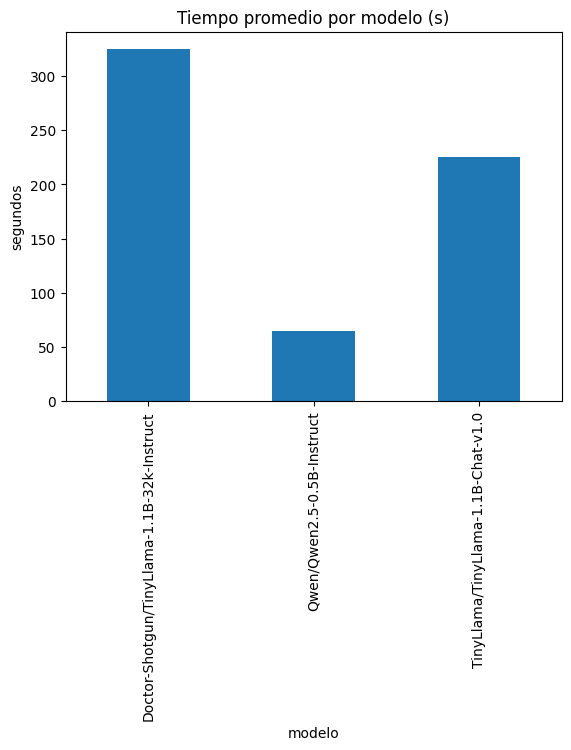
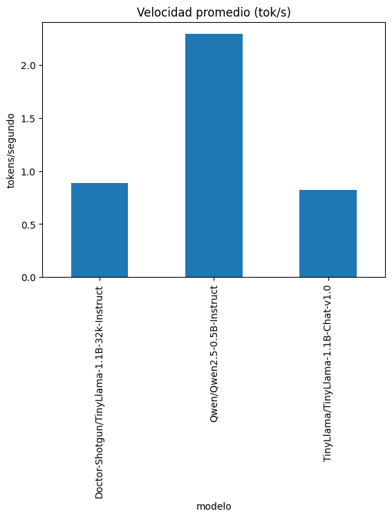

# HugginsFace Models (LLM's)

## Análisis comparativo de rendimiento de modelos de lenguaje

Los resultados muestran diferencias entre los tres modelos evaluados en **tiempo de inferencia**, **velocidad de generación** y **uso de recursos**, contrastados con la ejecución de **ChatGPT**.

### 1. Resultados generales de inferencia

| Modelo                                         | Tokens generados | Tiempo total (s)        | Velocidad (tokens/s) | Observaciones                                                                        |
| ---------------------------------------------- | ---------------- | ----------------------- | -------------------- | ------------------------------------------------------------------------------------ |
| **TinyLlama/TinyLlama-1.1B-Chat-v1.0**         | 180–185          | 195–256 ($\approx$ 3–4.1 min)   | 0.72–0.92            | Generación estable pero lenta; el tamaño del modelo (1.1B) eleva el tiempo de carga. |
| **Qwen/Qwen2.5-0.5B-Instruct**                 | 87–212           | 39–89 ($\approx$ 1.3 min)       | 2.2–2.4              | El más rápido; tamaño reducido (0.5B) y arquitectura optimizada.                     |
| **Doctor-Shotgun/TinyLlama-1.1B-32k-Instruct** | 272–302          | 320–329 ($\approx$ 5.3–5.5 min) | 0.83–0.94            | El más lento; contexto extendido (32k) aumenta el costo computacional.               |

Durante las pruebas, el uso de CPU osciló entre **17 % y 80 %**, y la **RAM** se mantuvo entre **52 % y 55 %**. No hubo uso de GPU (latencia alta).

### 2. Interpretación del rendimiento

- **TinyLlama:** inferencia lenta ($\approx$ 4 min). Lento para implementación en tiempo real.
- **Qwen:** más eficiente, completó la generación en menos de 90 s con buena coherencia.
- **Doctor-Shotgun:** el más costoso en tiempo (>5 min), coherente con su entrenamiento en contextos largos.

### 3. Comparación con ChatGPT

ChatGPT generó la misma respuesta casi **instantáneamente**, sin retardo perceptible.
Esto evidencia la diferencia entre:

- **Ejecución local:** dependiente del hardware y tamaño del modelo.
- **Ejecución en la nube (ChatGPT):** sobre infraestructura optimizada con GPUs y paralelización.

### 4. Resultados visuales

Las gráficas muestran el **tiempo promedio de respuesta** y la **velocidad de generación (tok/s)**, donde se confirma que Qwen supera en eficiencia a los otros modelos.

- **Doctor-Shotgun:** mayor tiempo, menor eficiencia.
- **TinyLlama:** rendimiento intermedio.
- **Qwen:** mejor equilibrio entre calidad, tiempo y velocidad.

### 5. Conclusiones

1. **Velocidad:** Qwen fue el más rápido; ChatGPT el más eficiente por su infraestructura.
2. **Recursos:** uso estable de RAM ($\approx$ 55 %) y CPU variable; la falta de GPU elevó los tiempos.
3. **Calidad:**
   - TinyLlama: salida genérica.
   - Qwen: precisa y estructurada.
   - Doctor-Shotgun: extensa pero menos coherente.
   - ChatGPT: clara y completa.
4. **Factores de lentitud:** carga inicial, tamaño (1.1B) y ejecución en CPU.
